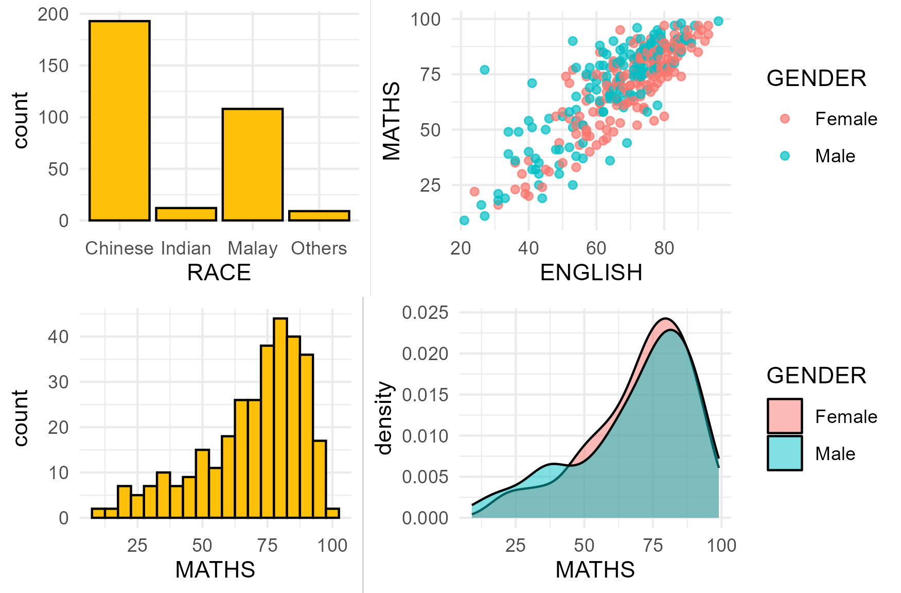

# 1. Overview



In data analytics, the gap between raw information and actionable business strategy is connected by visual architecture. I dedicated twenty hours to this deep-dive into the *Layered Grammar of Graphics* not simply to learn a package (`ggplot2`), but to create a better approach to data storytelling.

Coming from a background in Quality Assurance, I approach data visualization the same way I approach software: with a strict focus on integrity, structure, and user experience.

This exercise was an investment for my analytics infrastructure. It solidified my ability to translate data into a structure that prioritizes clarity.

# 2. Getting Started

::::: panel-tabset
## Installing and loading libraries

::: callout-tip
The code chunk below uses `p_load()`, a [pacman](https://rpubs.com/akshaypatankar/594834) package to check if the tidyverse library is installed in the computer.
:::

```{r}
pacman::p_load(tidyverse)
```

## Importing data

::: callout-tip
-   The code chunk below imports *exam_data.csv* into the R environment by using [*read_csv()*](https://readr.tidyverse.org/reference/read_delim.html) function of [**readr**](https://readr.tidyverse.org/) package.
-   **readr** is one of the tidyverse package.
:::

```{r}
exam_data <- read_csv("data/Exam_data.csv")
```
:::::

::::: panel-tabset
## Data summary

::: callout-tip
The summary shows a year-end examination grades.

There are 7 features:

\- Categorical: `ID`, `CLASS`, `GENDER`, `RACE`

\- Continuous: `MATH`, `ENGLISH`, `SCIENCE`
:::

```{r}
summary(exam_data)
```

## Data preview

::: callout-tip
These are the top rows of exam_data
:::

```{r}
head(exam_data)
```
:::::

# 3. R vs ggplot2

Comparison between R graphics and ggplot2

::: panel-tabset
## R graphics

```{r}
#| code-fold: true
#| code-summary: "Show the code"

hist(exam_data$MATHS, 
     ylab='Number of Students', 
     xlab='Score', 
     main='Distribution of Maths scores',
     col='#FFC107')
```

## ggplot2

```{r}
#| code-fold: true
#| code-summary: "Show the code"

ggplot(data=exam_data, aes(x = MATHS)) +
  geom_histogram(bins=10, 
                 boundary = 100,
                 color="black", 
                 fill="#FFC107") +
  labs(x = "Score",
       y = "Number of Students",
       title = "Distribution of Maths scores")
```
:::

### Why is ggplot2 recommended?

> The transferable skills from ggplot2 are not the idiosyncrasies of plotting syntax, but a powerful way of thinking about visualisation, as a way of mapping between variables and the visual properties of geometric objects that you can perceive. \~[Hadley Wickham](http://varianceexplained.org/r/teach_ggplot2_to_beginners/#comment-1745406157)

# 4. Layered Grammar of Graphics

Grammar of Graphics, introduced by Leland Wilkinson (1999), is a general scheme for data visualization which breaks up graphs into semantic components such as scales and layers. It defines the rules of structuring mathematical and aesthetic elements into a meaningful graph.


-   **`Themes`**: modify all non-data components of a plot, such as main title, sub-title, y-aixs title, or legend background.
-   **`Coordinates`**: define the plane on which data are mapped on the graphic.
-   **`Statistics`**: Statistical transformations that summarise data (e.g. mean, confidence intervals).
-   **`Facets`**: split the data into subsets to create multiple variations of the same graph (paneling, multiple plots).
-   **`Geometries`**: The visual elements used for our data, such as point, bar or line.
-   **`Aesthetics`**: Take attributes of the data and use them to influence visual characteristics, such as position, colors, size, shape, or transparency.
-   **`Data`**: The dataset being plotted.

# 5. Essential element in ggplot2 - Data

Let us call the ggplot() function using the code chunk below.

::: callout-tip
-   A blank canvas appears.
-   ggplot() initializes a ggplot object.
-   The data argument defines the dataset to be used for plotting.
-   If the dataset is not already a data.frame, it will be converted to one by fortify().
:::

```{r}
ggplot(data=exam_data)
```

# 6. Essential element in ggplot2 - Aesthetics

The aesthetic mappings take attributes of the data and and use them to influence visual characteristics, such as position, color, size, shape, or transparency. Each visual characteristic can thus encode an aspect of the data and be used to convey information.

::: callout-tip
-   All aesthetics of a plot are specified in the [`aes()`](https://ggplot2.tidyverse.org/reference/aes.html) function call.
-   Code chunk below adds the aesthetic element into the plot.
-   ggplot2 includes the x-axis and the axis’s label.
:::

```{r}
ggplot(data=exam_data,
       aes(x=MATHS))
```

# 7. Essential element in ggplot2 - Geometries

Geometric objects are the actual marks we put on a plot, in this exercise, I will showcase:

-   **`geom_bar`**: Creates bar charts to visualize the frequency, count, or proportion of categorical variables.
-   **`geom_dotplot`**: Represents individual data points as stacked dots to show the exact distribution of small, continuous datasets.
-   **`geom_histogram`**: Groups continuous data into connected vertical bins to display its underlying frequency distribution.
-   **`geom_density`**: Creates a smoothed, continuous curve to estimate the probability distribution of a numeric variable.
-   **`geom_boxplot`**: Summarizes the spread of continuous data using its median, quartiles, and potential statistical outliers.
-   **`geom_violin`**: Combines a boxplot and a density plot to reveal the full shape, width, and peaks of a data distribution.
-   **`geom_point`**: Creates scatter plots by plotting individual coordinates to display the relationship between two continuous variables.

::: callout-tip
-   A plot must have at least one geom; there is no upper limit. You can add a geom to a plot using the + operator.
-   For complete list, please refer to [here](https://ggplot2.tidyverse.org/reference/#section-layer-geoms).
:::

## 7.1 Object: *geom_bar*

::: callout-tip
The code chunk below plots a bar chart by using [`geom_bar()`](https://ggplot2.tidyverse.org/reference/geom_bar.html).
:::

```{r}
ggplot(data=exam_data, 
       aes(x=RACE)) +
  geom_bar()
```

## 7.2 Object: *geom_dotplot*

::: callout-tip
In the code chunk below, geom_dotplot() of ggplot2 is used to plot a dot plot.
:::

::::: panel-tabset
## geom_dotplot()

::: callout-caution
-   The ***y*** scale is not very useful, in fact it is very misleading.
-   *Binwidth* defaults to 1/30 of the range of the data.
:::

```{r}
ggplot(data=exam_data, 
       aes(x = MATHS)) +
  geom_dotplot(dotsize = 0.5)
```

## geom_dotplot() - *modified*

::: callout-note
## Fix

The code chunk below performs the following two steps:

\- `scale_y_continuous()` is used to turn off the y-axis, and - *binwidth* argument is used to change the binwidth to 2.5.
:::

```{r}
ggplot(data=exam_data, 
       aes(x = MATHS)) +
  geom_dotplot(binwidth=2.5,         
               dotsize = 0.5) +      
  scale_y_continuous(NULL,           
                     breaks = NULL)  
```
:::::

## 7.3 Object: geom_histogram()

In the code chunk below, [*geom_histogram()*](https://ggplot2.tidyverse.org/reference/geom_histogram.html) is used to create a simple histogram by using values in *MATHS* field of *exam_data*.

::::: panel-tabset
## geom_histogram()

::: callout-warning
Note that the default bin is **30**.
:::

```{r}
ggplot(data=exam_data, 
       aes(x = MATHS)) +
  geom_histogram()       
```

## geom_histogram() - *modified*

::: callout-tip
For grades, a *binwidth* of 5 or 10 is the standard "human logic" approach.
:::

```{r}
ggplot(data=exam_data, 
       aes(x = MATHS)) +
  geom_histogram(binwidth = 5)       
```
:::::

## 7.4 Modifying a geometric object

::::: panel-tabset
## *modifying: geom()*

::: callout-tip
-   bins argument is used to change the number of bins,
-   fill argument is used to shade the histogram, and
-   color argument is used to change the outline colour of the bars
:::

```{r}
ggplot(data=exam_data, 
       aes(x= MATHS)) +
  geom_histogram(bins=20,            
                 color="black",      
                 fill="#FFC107")  
```

## *modifying: aes()*

::: callout-tip
-   The code chunk below changes the interior color of the histogram (i.e. fill) by using sub-group of aesthetic().
-   This approach can be used to color or fill the alpha of the geometric.
:::

```{r}
ggplot(data=exam_data, 
       aes(x= MATHS, 
           fill = GENDER)) +
  geom_histogram(bins=20, 
                 color="grey30")
```
:::::

## 7.5 Object: geom_density()

[`geom-density()`](https://ggplot2.tidyverse.org/reference/geom_density.html) computes and plots [kernel density estimate](https://en.wikipedia.org/wiki/Kernel_density_estimation), which is a smoothed version of the histogram. It is a useful alternative to the histogram for continuous data that comes from an underlying smooth distribution.

::::: panel-tabset
## geom_density()

::: callout-note
The code below plots the distribution of Maths scores in a kernel density estimate plot.
:::

```{r}
ggplot(data=exam_data, 
       aes(x = MATHS)) +
  geom_density()           
```

## geom_density() - *modified*

::: callout-note
The code chunk below plots two kernel density lines by using color or fill arguments of aes()
:::

```{r}
ggplot(data=exam_data, 
       aes(x = MATHS, 
           colour = GENDER, fill = GENDER)) +
  geom_density(alpha = 0.5)
```
:::::

## 7.6 Object: geom_boxplot

[`geom_boxplot()`](https://ggplot2.tidyverse.org/reference/geom_boxplot.html) displays continuous value list. It visualises five summary statistics (the median, two hinges and two whiskers), and all “outlying” points individually.

::: panel-tabset
## geom_boxplot

```{r}
ggplot(data=exam_data, 
       aes(y = MATHS,       
           x= GENDER)) +    
  geom_boxplot()
```

## boxplot - *notches*

[Notches](https://sites.google.com/site/davidsstatistics/home/notched-box-plots) are used in box plots to help visually assess whether the medians of distributions differ. If the notches do not overlap, this is evidence that the medians are different.

The code chunk below plots the distribution of Maths scores by gender in notched plot instead of boxplot.

```{r}
ggplot(data=exam_data, 
       aes(y = MATHS, 
           x= GENDER)) +
  geom_boxplot(notch=TRUE)
```

## boxplot - *facet_wrap*

We can also incorporate facet_wrap() to create boxplots of math scores for each class that is separated by gender.

```{r}
ggplot(data = exam_data, 
       aes(y = MATHS, 
           x = CLASS)) +
  geom_boxplot() + 
  facet_wrap(~ GENDER)
```
:::

## 7.7 Object: geom_violin

[`geom_violin`](https://ggplot2.tidyverse.org/reference/geom_violin.html) is designed for creating violin plot. Violin plots are a way of comparing multiple data distributions. With ordinary density curves, it is difficult to compare more than just a few distributions because the lines visually interfere with each other. With a violin plot, it’s easier to compare several distributions since they’re placed side by side.

::: callout-note
The code below plot the distribution of Maths score by gender in violin plot.
:::

```{r}
ggplot(data=exam_data, 
       aes(y = MATHS, 
           x= GENDER)) +
  geom_violin()
```

## 7.8 Object: geom_point

[`geom_point()`](https://ggplot2.tidyverse.org/reference/geom_point.html) is especially useful for creating scatterplot.

:::: panel-tabset
## geom_point()

::: callout-note
The code chunk below plots a scatterplot showing the Maths and English grades of pupils by using `geom_point()`, grouped by gender.
:::

```{r}
ggplot(data=exam_data, 
       aes(y = MATHS, 
           x= ENGLISH,
           color = GENDER)) +
  geom_point()
```

## geom_point() - *modified*

To add reference lines:

```{r}
ggplot(data=exam_data, 
       aes(x= ENGLISH, 
           y = MATHS, 
           color = GENDER)) +
  geom_point() +
  coord_cartesian(xlim=c(0,100),
                  ylim=c(0,100)) +
  geom_vline(aes(xintercept = 50),
             col = 'grey',
             linewidth = 0.5,
             linetype = "dashed") + 
  geom_hline(aes(yintercept = 50),
             col = 'grey',
             linewidth = 0.5,
             linetype = "dashed") +  
  labs(x = "English Score",
       y = "Math Score",
       title = "Math Score against English Score by Gender")

```
::::

## 7.9 Combination of objects

The code chunk below plots the data points on the boxplots by using both `geom_boxplot()` and `geom_point()`.

::: callout-important
Order of geom layer matters! In the code below, boxplot is plotted after/above the scatter and thus covers parts of the scatterplot.
:::

::: panel-tabset
## combination

```{r}
ggplot(data=exam_data, 
       aes(y = MATHS, 
           x= GENDER)) +

  geom_point(position = 'jitter',
             size=0.5) +
  geom_boxplot()
```

## combination - *modified*

```{r}
ggplot(data=exam_data, 
       aes(y = MATHS, 
           x= GENDER)) +
  geom_boxplot() +                    
  geom_point(position="jitter", 
             size = 0.5)
```
:::

# 8. Essential element in ggplot2 - stat

The [Statistics functions](https://ggplot2.tidyverse.org/reference/#stats) statistically transform data, usually as some form of summary. For example:

-   frequency of values of a variable (bar graph)

    -   a mean
    -   a confidence limit

-   There are two ways to use these functions:

    -   add a `stat_()` function and override the default geom, or
    -   add a `geom_()` function and override the default stat.

## 8.1 Working with stat()

The boxplots below are incomplete because the positions of the means were not shown.

```{r}
ggplot(data=exam_data,
       aes( y= MATHS, x = GENDER)) +
  geom_boxplot()
```

## 8.2 Working with stat - the stat_summary() method

The code chunk below **adds mean values** by using [`stat_summary()`](https://ggplot2.tidyverse.org/reference/stat_summary.html) function and overriding the default geom.

```{r}
ggplot(data=exam_data, 
       aes(y = MATHS, x= GENDER)) +
  geom_boxplot() +
  stat_summary(geom = 'point',
               fun='mean',
               colour = 'red',
               size=4)
```

## 8.3 Working with stat - the geom() method

The code chunk below adding mean values by using `geom_()` function and overriding the default stat.

```{r}
ggplot(data=exam_data, 
       aes(y = MATHS, x= GENDER)) +
  geom_boxplot() +
  geom_point(stat="summary",        
             fun="mean",           
             colour="red",          
             size=4)          
```

## 8.4 Adding best fit curve

The scatterplot below shows the relationship of Maths and English grades of pupils. The interpretability of this graph can be improved by adding a best fit curve.

:::::: panel-tabset
## geom_smooth

::: callout-tip
In the code chunk below, geom_smooth() is used to plot a best fit curve on the scatterplot.

The default method used is loess.
:::

```{r}
ggplot(data=exam_data, 
       aes(x= MATHS, y=ENGLISH)) +
  geom_point() +
  geom_smooth(linewidth=1)
```

## loess - override

::: callout-tip
The default smoothing method can be overridden as shown below.
:::

```{r}
ggplot(data=exam_data, 
       aes(x= MATHS, y=ENGLISH)) +
  geom_point() +
  geom_smooth(linewidth=1, method = lm)
```

## add-on

::: callout-tip
To add equation and R\^2 to the plot, we need to download the library ggpmisc.
:::

```{r}
pacman::p_load(ggpmisc)
```

stat_poly_line() is used to add lm line and stat_poly_eq() displays the equation and R-square value.

```{r}
ggplot(data=exam_data, 
       aes(x= MATHS, y=ENGLISH)) +
  stat_poly_line() +
  stat_poly_eq(use_label(c("eq", "R2"))) +
  geom_point()
```
::::::

# 9. Essential element in ggplot2 - Facets

Facetting generates small multiples (sometimes also called trellis plot), each displaying a different subset of the data. They are an alternative to aesthetics for displaying additional discrete variables. ggplot2 supports two types of factes, namely: [`facet_wrap`](https://ggplot2.tidyverse.org/reference/facet_wrap.html) and [`facet_grid()`](https://ggplot2.tidyverse.org/reference/facet_grid.html).

## 9.1 Working with facet_wrap()

[`facet_wrap`](https://ggplot2.tidyverse.org/reference/facet_wrap.html) wraps a 1d sequence of panels into 2d. This is generally a better use of screen space than `facet_grid` because most displays are roughly rectangular.

:::: panel-tabset
## facet_wrap()

::: callout-note
The code chunk below plots a trellis plot using `facet-wrap()`.
:::

```{r}
ggplot(data=exam_data,
       aes(x=MATHS)) +
  geom_histogram(bins=20) +
  facet_wrap(~CLASS) +
  labs(y='Number of students', 
       x='Math scores',
       title = "Math Scores by Class")
```

## facet_wrap() - *extras*

Separation by Color, combined by gender (The fill Aesthetic)

```{r}
ggplot(data = exam_data,        
       aes(x = MATHS, 
           fill = GENDER)) +
  geom_histogram(bins = 20, 
                 position = "dodge",
                 color = "black") + 
  facet_wrap(~ CLASS)
```

Separation by Gender (facet_grid)

```{r}
ggplot(data = exam_data,        
       aes(x = MATHS)) +  
  geom_histogram(bins = 20, 
                 color = "black") +    
  facet_grid(GENDER ~ CLASS)
```
::::

## 9.2 facet_grid() function

[`facet_grid()`](https://ggplot2.tidyverse.org/reference/facet_grid.html) forms a matrix of panels defined by row and column facetting variables. It is most useful when you have two discrete variables, and all combinations of the variables exist in the data.

::: callout-note
The code chunk below plots a trellis plot using `facet_grid()`.
:::

```{r}
ggplot(data=exam_data, 
       aes(x= MATHS)) +
  geom_histogram(bins=20) +
    facet_grid(~ CLASS)
```

# 10. Essential element in ggplot2 - Coordinates

The *Coordinates* functions map the position of objects onto the plane of the plot. There are a number of different possible coordinate systems to use, they are:

-   [`coord_cartesian()`](https://ggplot2.tidyverse.org/reference/coord_cartesian.html): the default Cartesian coordinate systems, where you specify x and y values (e.g. allows you to zoom in or out).
-   [`coord_flip()`](https://ggplot2.tidyverse.org/reference/coord_flip.html): a Cartesian system with the x and y flipped.
-   [`coord_fixed()`](https://ggplot2.tidyverse.org/reference/coord_fixed.html): a Cartesian system with a “fixed” aspect ratio (e.g. 1.78 for a “widescreen” plot).
-   [`coord_quickmap()`](https://ggplot2.tidyverse.org/reference/coord_map.html): a coordinate system that approximates a good aspect ratio for maps.

## 10.1 Working with Coordinate

::: panel-tabset
## Vertical

By the default, the bar chart of ggplot2 is in vertical form.

```{r}
ggplot(data=exam_data, 
       aes(x=RACE)) +
  geom_bar()
```

## Horizontal

The code chunk below flips the horizontal bar chart into vertical bar chart by using coord_flip().

```{r}
ggplot(data=exam_data, 
       aes(x=RACE)) +
  geom_bar() +
  coord_flip()
```
:::

## 10.2

::: panel-tabset
## raw

The scatterplot on the right is slightly misleading because the y-axis and x-axis range are not equal.

```{r}
ggplot(data=exam_data, 
       aes(x= MATHS, y=ENGLISH)) +
  geom_point() +
  geom_smooth(method=lm, size=0.5)
```

## fixed

The code chunk below fixed both the y-axis and x-axis range from 0-100.

```{r}
ggplot(data=exam_data, 
       aes(x= MATHS, y=ENGLISH)) +
  geom_point() +
  geom_smooth(method=lm, 
              size=0.5) +  
  coord_cartesian(xlim=c(0,100),
                  ylim=c(0,100))
```
:::

# 11. Working with theme

::: panel-tabset
## theme_gray()

The code chunk below plot a horizontal bar chart using `theme_gray()`.

```{r}
ggplot(data=exam_data, 
       aes(x=RACE)) +
  geom_bar() +
  coord_flip() +
  theme_gray()
```

## theme_classic()

A horizontal bar chart plotted using `theme_classic()`.

```{r}
ggplot(data=exam_data, 
       aes(x=RACE)) +
  geom_bar() +
  coord_flip() +
  theme_classic()
```

## theme_minimal()

A horizontal bar chart plotted using `theme_minimal()`.

```{r}
ggplot(data=exam_data, 
       aes(x=RACE)) +
  geom_bar() +
  coord_flip() +
  theme_minimal()
```
:::

# 12. Reference

-   Hadley Wickham (2023) [**ggplot2: Elegant Graphics for Data Analysis**](https://ggplot2-book.org/). Online 3rd edition.
-   Winston Chang (2013) [**R Graphics Cookbook 2nd edition**](https://r-graphics.org/). Online version.
-   Healy, Kieran (2019) [**Data Visualization: A practical introduction**](https://socviz.co/). Online version
-   [Learning ggplot2 on Paper – Components](https://henrywang.nl/learning-ggplot2-on-paper-components/)
-   [Learning ggplot2 on Paper – Layer](https://henrywang.nl/learning-ggplot2-on-paper-layer/)
-   [Learning ggplot2 on Paper – Scale](https://henrywang.nl/tag/learning-ggplot2-on-paper/)
