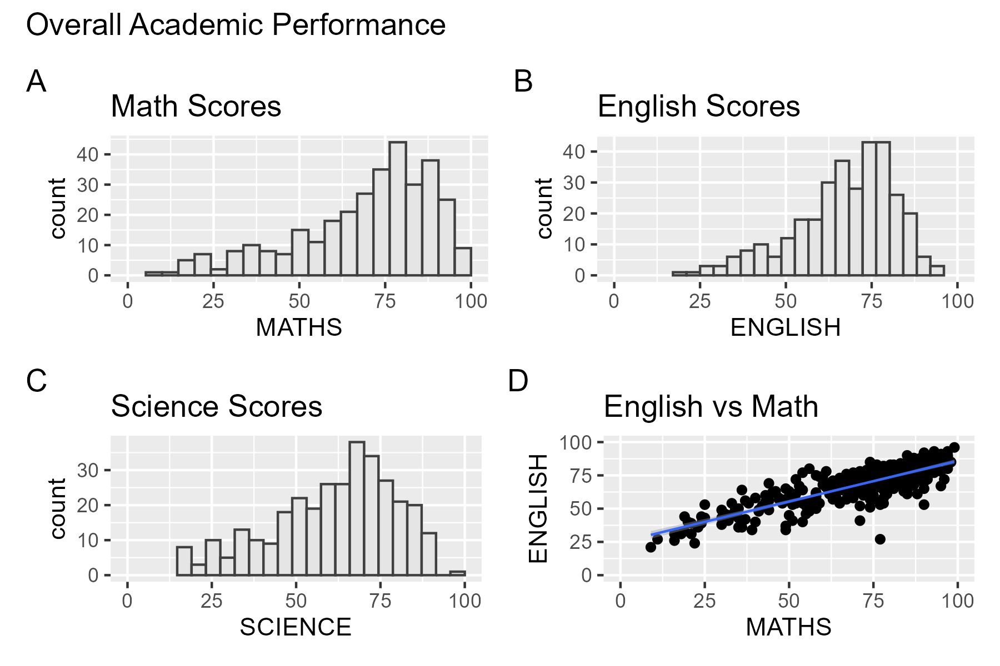

# 1. Overview

 


In this chapter, I learned about ggplot2 extensions for creating more effective statistical graphics.

The goals of this exercise was to:

-   control the placement of annotation on a graph by using functions provided in ggrepel package,
-   create professional publication quality figure by using functions provided in ggthemes and hrbrthemes packages, and
-   plot composite figure by combining ggplot2 graphs by using patchwork package.

# 2. Getting Started

::: panel-tabset
## Installing and loading libraries

In this exercise, beside tidyverse, four R packages will be used. They are: - **`ggrepel`**: an R package provides geoms for ggplot2 to repel overlapping text labels. - **`ggthemes`**: an R package provides some extra themes, geoms, and scales for ‘ggplot2’. - **`hrbrthemes`**: an R package provides typography-centric themes and theme components for ggplot2. - **`patchwork`**: an R package for preparing composite figure created using ggplot2.

```{r}
pacman::p_load(ggrepel, patchwork, 
               ggthemes, hrbrthemes,
               tidyverse) 
```

## Importing data

For the purpose of this exercise, a data file called *Exam_data* will be used. It consists of year end examination grades of a cohort of primary 3 students from a local school. It is in csv file format.

The code chunk below imports *exam_data.csv* into R environment by using [*read_csv()*](https://readr.tidyverse.org/reference/read_delim.html) function of [**readr**](https://readr.tidyverse.org/) package. **readr** is one of the tidyverse package.

```{r}
exam_data <- read_csv("data/Exam_data.csv")
```
:::

::::: panel-tabset
## Data summary

::: callout-tip
The summary shows a year-end examination grades.

There are 7 features:

\- Categorical: `ID`, `CLASS`, `GENDER`, `RACE`

\- Continuous: `MATH`, `ENGLISH`, `SCIENCE`
:::

```{r}
summary(exam_data)
```

## Data preview

::: callout-tip
These are the top rows of exam_data
:::

```{r}
head(exam_data)
```

## Glimpse

```{r}
glimpse(exam_data)
```
:::::

# 3. Beyond ggplot2: ggrepel

One of the challenge in plotting statistical graph is annotation, especially with large number of data points.

```{r}
#| code-fold: true
#| code-summary: "Show the code"
ggplot(data=exam_data, 
       aes(x= MATHS, 
           y=ENGLISH)) +
  geom_point() +
  geom_smooth(method=lm, 
              linewidth=0.5) +  
  geom_label(aes(label = ID), 
             hjust = .5, 
             vjust = -.5) +
  coord_cartesian(xlim=c(0,100),
                  ylim=c(0,100)) +
  ggtitle("English scores versus Math scores for Primary 3")
```

[**ggrepel**](https://ggrepel.slowkow.com/) is an extension of **ggplot2** package which provides `geoms` for **ggplot2** to repel overlapping text as in our examples on the right.

We simply replace `geom_text()` by `geom_text_repel()` and `geom_label()` by geom_label_repel.

## 3.1 Working with ggrepel

```{r}
#| code-fold: true
#| code-summary: "Show the code"
ggplot(data=exam_data, 
       aes(x= MATHS, 
           y=ENGLISH)) +
  geom_point() +
  geom_smooth(method=lm, 
              size=0.5) +  
  geom_label_repel(aes(label = ID), 
                   fontface = "bold") +
  coord_cartesian(xlim=c(0,100),
                  ylim=c(0,100)) +
  ggtitle("English scores versus Math scores for Primary 3")
```

# 4. Beyond ggplot2: Themes

ggplot2 comes with eight [built-in themes](https://ggplot2.tidyverse.org/reference/ggtheme.html), they are: `theme_gray()`, `theme_bw()`, `theme_classic()`, `theme_dark()`, `theme_light()`, `theme_linedraw()`, `theme_minimal()`, and `theme_void()`.

```{r}
#| code-fold: true
#| code-summary: "Show the code"
ggplot(data=exam_data, 
             aes(x = MATHS)) +
  geom_histogram(bins=20, 
                 boundary = 100,
                 color="grey25", 
                 fill="grey90") +
  theme_gray() +
  ggtitle("Distribution of Maths scores") 
```

Refer to this [link](https://ggplot2.tidyverse.org/reference/index.html#themes) to learn more about ggplot2 `Themes`

::: panel-tabset
## ggthemes

[**ggthemes**](https://cran.r-project.org/web/packages/ggthemes/index.html) provides [‘ggplot2’ themes](https://yutannihilation.github.io/allYourFigureAreBelongToUs/ggthemes/) that replicate the look of plots by Edward Tufte, Stephen Few, [Fivethirtyeight](https://fivethirtyeight.com/), [The Economist](https://www.economist.com/graphic-detail), ‘Stata’, ‘Excel’, and [The Wall Street Journal](https://www.pinterest.com/wsjgraphics/wsj-graphics/), among others.

```{r}
#| code-fold: true
#| code-summary: "Show the code"
ggplot(data=exam_data, 
             aes(x = MATHS)) +
  geom_histogram(bins=20, 
                 boundary = 100,
                 color="grey25", 
                 fill="grey90") +
  ggtitle("Distribution of Maths scores") +
  theme_economist()
```

## hrbthemes

[**hrbrthemes**](https://cinc.rud.is/web/packages/hrbrthemes/) package provides a base theme that focuses on typographic elements, including where various labels are placed as well as the fonts that are used. The second goal centers around productivity for a production workflow. In fact, this “production workflow” is the context for where the elements of hrbrthemes should be used.

```{r}
#| code-fold: true
#| code-summary: "Show the code"
ggplot(data=exam_data, 
             aes(x = MATHS)) +
  geom_histogram(bins=20, 
                 boundary = 100,
                 color="grey25", 
                 fill="grey90") +
  ggtitle("Distribution of Maths scores") +
  theme_ipsum()
```

## hrbthemes - modified

```{r}
#| code-fold: true
#| code-summary: "Show the code"
ggplot(data=exam_data, 
             aes(x = MATHS)) +
  geom_histogram(bins=20, 
                 boundary = 100,
                 color="grey25", 
                 fill="grey90") +
  ggtitle("Distribution of Maths scores") +
  theme_ipsum(axis_title_size = 18,
              base_size = 15,
              grid = "Y")
```
:::

# 5. Beyond Single Graph

It is not unusual that multiple graphs are required to tell a compelling visual story. There are several ggplot2 extensions provide functions to compose figure with multiple graphs. In this section, we create composite plot by combining multiple graphs. First, create three statistical graphics by using the code chunk below.

::: panel-tabset
## Math Scores

```{r}
#| code-fold: true
#| code-summary: "Show the code"
p1 <- ggplot(data=exam_data, 
             aes(x = MATHS)) +
  geom_histogram(bins=20, 
                 boundary = 100,
                 color="grey25", 
                 fill="grey90") + 
  coord_cartesian(xlim=c(0,100)) +
  ggtitle("Distribution of Math scores")

p1
```

## English Scores

```{r}
#| code-fold: true
#| code-summary: "Show the code"
p2 <- ggplot(data=exam_data, 
             aes(x = ENGLISH)) +
  geom_histogram(bins=20, 
                 boundary = 100,
                 color="grey25", 
                 fill="grey90") +
  coord_cartesian(xlim=c(0,100)) +
  ggtitle("Distribution of English scores")

p2
```

## Math vs English

```{r}
#| code-fold: true
#| code-summary: "Show the code"
p3 <- ggplot(data=exam_data, 
             aes(x= MATHS, 
                 y=ENGLISH)) +
  geom_point() +
  geom_smooth(method=lm, 
              size=0.5) +  
  coord_cartesian(xlim=c(0,100),
                  ylim=c(0,100)) +
  ggtitle("English scores versus Math scores for Primary 3")

p3
```
:::

## 5.1 Creating Composite Graphics: pathwork methods

There are several ggplot2 extension’s functions support the needs to prepare composite figure by combining several graphs such as [`grid.arrange()`](https://cran.r-project.org/web/packages/gridExtra/vignettes/arrangeGrob.html) of **gridExtra** package and [`plot_grid()`](https://wilkelab.org/cowplot/reference/plot_grid.html) of [**cowplot**](https://wilkelab.org/cowplot/) package. In this section, we use ggplot2 extension called [**patchwork**](https://patchwork.data-imaginist.com/) which is specially designed for combining separate ggplot2 graphs into a single figure.

Patchwork package has a very simple syntax, such as:

-   Two-Column Layout using the Plus Sign +.
-   Parenthesis () to create a subplot group.
-   Two-Row Layout using the Division Sign `/`

## 5.2 Combining two ggplot2 graphs

Figure below shows a composite of two histograms created using patchwork.

::: panel-tabset
## Horizontal

```{r}
#| code-fold: true
#| code-summary: "Show the code"
p1 + p2
```

## Vertical

```{r}
#| code-fold: true
#| code-summary: "Show the code"
p1 / p2
```

## Relative area

```{r}
#| code-fold: true
#| code-summary: "Show the code"
p1 + p2 + plot_layout(ncol=2,widths=c(2,1))
```
:::

## 5.3 Combining three ggplot2 graphs

We can plot more complex composite by using appropriate operators. For example, the composite figure below is plotted by using:

-   “\|” operator to stack two ggplot2 graphs,
-   “/” operator to place the plots beside each other,
-   “()” operator the define the sequence of the plotting.

::: panel-tabset
## / and \| operators

```{r}
#| code-fold: true
#| code-summary: "Show the code"
(p1 / p2) | p3
```

## - operator (subtraction)

```{r}
#| code-fold: true
#| code-summary: "Show the code"
p1 + p2 - p3 + plot_layout(ncol=1)
```

## Nested layouts

```{r}
#| code-fold: true
#| code-summary: "Show the code"
p3 + {
  p1 + p2 + plot_layout(ncol=1)
}
```

## With non-ggplot content

```{r}
#| code-fold: true
#| code-summary: "Show the code"
((p1 / p2) | p3) + grid:: textGrob('(Can add content here.)', hjust=0, x=-0, gp=grid::gpar(font=3, fontsize = 12))
```
:::

To learn more, refer to [Plot Assembly](https://patchwork.data-imaginist.com/articles/guides/assembly.html).

## 5.4 Creating a composite figure with tag

In order to identify subplots in text, **patchwork** also provides auto-tagging capabilities as shown in the figure below.

::: panel-tabset
## Enumeration

```{r}
#| code-fold: true
#| code-summary: "Show the code"
((p1 / p2) | p3) +
  plot_annotation(tag_levels = 'I')
```

## With tagging

```{r}
#| code-fold: true
#| code-summary: "Show the code"
((p1 / p2) | p3)  + 
  plot_layout(tag_level = 'new') +
  plot_annotation(tag_levels = c('A', '1'), tag_prefix = 'Fig. ', tag_sep = '.', 
                  tag_suffix = ':')
```
:::

## 5.5 Creating figure with inset

Beside providing functions to place plots next to each other based on the provided layout. With [`inset_element()`](https://patchwork.data-imaginist.com/reference/inset_element.html) of **patchwork**, we can place one or several plots or graphic elements freely on top or below another plot.

```{r}
#| code-fold: true
#| code-summary: "Show the code"
p4 <- ggplot(data=exam_data, 
             aes(x = MATHS)) +
  geom_histogram(bins=20, 
                 boundary = 100,
                 color="grey25", 
                 fill="grey90") + 
  coord_cartesian(xlim=c(0,100)) +
  ggtitle("Distribution of Math scores")

p5 <- ggplot(data=exam_data, 
             aes(x = ENGLISH)) +
  geom_histogram(bins=20, 
                 boundary = 100,
                 color="grey25", 
                 fill="grey90") +
  coord_cartesian(xlim=c(0,100)) +
  ggtitle("Distribution of English scores")

p6 <- ggplot(data=exam_data, 
             aes(x= MATHS, 
                 y=ENGLISH)) +
  geom_point() +
  geom_smooth(method=lm, 
              size=0.5) +  
  coord_cartesian(xlim=c(0,100),
                  ylim=c(0,100)) +
  ggtitle("Correlation between English & Math scores")

p6 +  inset_element(p5,
                    left = 0.02,
                    bottom=0.7,
                    right= 0.5,
                    top=1)
```

## 5.6 Composite figure: Patchwork + ggtheme

Figure below is created by combining patchwork and theme_economist() of ggthemes package discussed earlier.

::: panel-tabset
## theme_economist()

```{r}
#| code-fold: true
#| code-summary: "Show the code"
patchwork <- ((p4/p5) | p6)

patchwork & theme_economist() +
  theme(plot.title=element_text(size =10),
                                        axis.title.y=element_text(size = 9,
                                                                  angle = 0,
                                                                  vjust=0.9),
                                         axis.title.x=element_text(size = 9))
```

## theme_solarized

```{r}
#| code-fold: true
#| code-summary: "Show the code"
patchwork & theme_solarized() +
  theme(plot.title=element_text(size =10),
                                        axis.title.y=element_text(size = 9,
                                                                  angle = 0,
                                                                  vjust=0.9),
                                         axis.title.x=element_text(size = 9))
```
:::

# 6. References

-   [Patchwork R package goes nerd viral](https://www.littlemissdata.com/blog/patchwork)
-   [ggrepel](https://ggrepel.slowkow.com/)
-   [ggthemes](https://ggplot2.tidyverse.org/reference/ggtheme.html)
-   [hrbrthemes](https://cinc.rud.is/web/packages/hrbrthemes/)
-   [ggplot tips: Arranging plots](https://albert-rapp.de/post/2021-10-28-extend-plot-variety/)
-   [ggplot2 Theme Elements Demonstration](https://henrywang.nl/ggplot2-theme-elements-demonstration/)
-   [ggplot2 Theme Elements Reference Sheet](https://isabella-b.com/blog/ggplot2-theme-elements-reference/)
