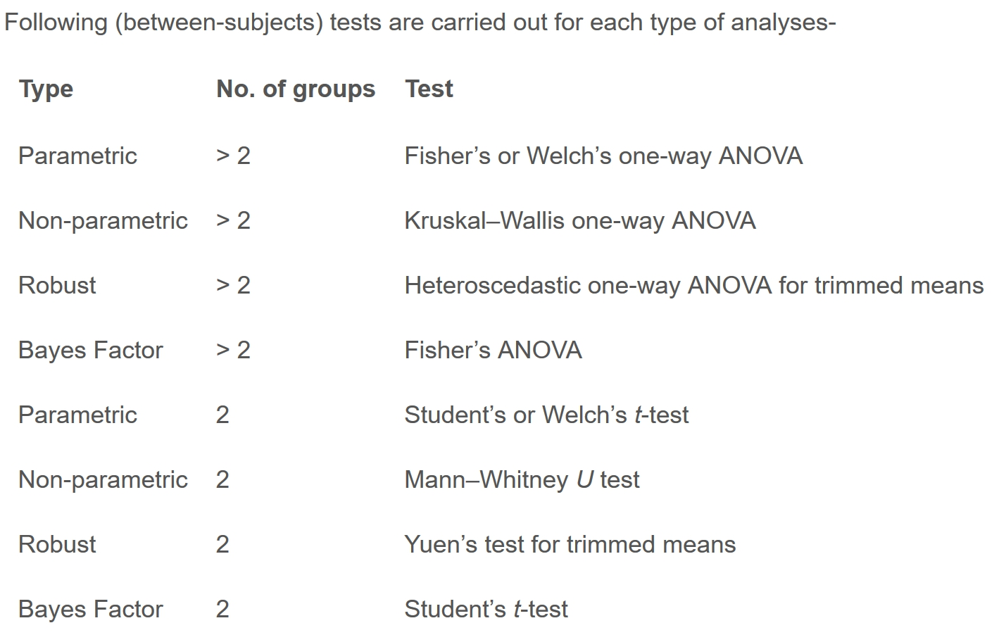

# 1 Learning Outcome

In this hands-on exercise, you will gain hands-on experience on using:

-   ggstatsplot package to create visual graphics with rich statistical information,
-   performance package to visualise model diagnostics, and
-   parameters package to visualise model parameters

# 2 Getting Started

::: panel-tabset
## Installing and loading libraries

Use the pacman package to check, install and launch the R packages **ggstatplot** and **tidyverse**.

```{r}
pacman::p_load(ggstatsplot, tidyverse, nortest, ggdist)
```

[**ggstatsplot**](https://indrajeetpatil.github.io/ggstatsplot/) is an extension of [**ggplot2**](https://ggplot2.tidyverse.org/) package for creating graphics with details from statistical tests included in the information-rich plots themselves.

## Importing Data

In this section, *Exam_data.csv* provided will be used. Using [*read_csv()*](https://readr.tidyverse.org/reference/read_delim.html) of **readr** package, import *Exam_data.csv* into R.

The code chunk below `read_csv()` of **readr** package is used to import *Exam_data.csv* data file into R and save it as an tibble data frame called `exam_data`.

```{r}
exam <- read_csv("data/Exam_data.csv")
```

The data is a tibble dataframe and contains 322 observations across 7 attributes.

## Understanding the Data

```{r}
#| echo: false
head(exam, 5)
```

```{r}
glimpse(exam)
summary(exam)

```

## Converting data types

```{r}
col <- c("CLASS", "GENDER", "RACE")

exam <- exam %>% 
  mutate(across(col, as.factor)) %>% 
  mutate(ID = as.character(ID))
```
:::

# 3 TESTS

## 3.1 One-sample test: *gghistostats()* method

In the code chunk below, [*gghistostats()*](https://indrajeetpatil.github.io/ggstatsplot/reference/gghistostats.html) is used to to build an visual of one-sample test on English scores.

-   A one-sample test is a statistical hypothesis test used to determine whether the mean of **a single sample of data** differs significantly from a known or hypothesized value.

-   It is a statistical test that compares the mean of a sample to a specified value, such as a population mean, to see if there is enough evidence to reject the null hypothesis that the sample comes from a population with the specified mean.

**H0: EL average score is 60.**

```{r}
set.seed(1234)

gghistostats(
  data = exam,
  x = ENGLISH,
  type = "bayes",
  test.value = 60,          #<< H0: EL = 60
  xlab = "English scores"
)
```

### 3.1.1 Bayes Factor

-   A Bayes factor is the ratio of the likelihood of one particular hypothesis to the likelihood of another. It can be interpreted as a measure of the strength of evidence in favor of one theory among two competing theories.

-   That's because the Bayes factor gives us a way to evaluate the data in favor of a null hypothesis, and to use external information to do so. It tells us what the weight of the evidence is in favor of a given hypothesis.

-   When we are comparing two hypotheses, H1 (the alternate hypothesis) and H0 (the null hypothesis), the Bayes Factor is often written as **B10**.

-   The [**Schwarz criterion**](https://www.statisticshowto.com/bayesian-information-criterion/) is one of the easiest ways to calculate rough approximation of the Bayes Factor.

### **How to interpret Bayes Factor**

A **Bayes Factor** can be any positive number. One of the most common interpretations is this one—first proposed by Harold Jeffereys (1961) and slightly modified by [Lee and Wagenmakers](https://www-tandfonline-com.libproxy.smu.edu.sg/doi/pdf/10.1080/00031305.1999.10474443?needAccess=true) in 2013:


## 3.2 Two-sample mean test: *ggbetweenstats()*

In the code chunk below, [*ggbetweenstats()*](https://indrajeetpatil.github.io/ggstatsplot/reference/ggbetweenstats.html) is used to build a visual for two-sample mean test of Maths scores by gender (independent).

**H0: Mean of F and M Math scores are the same.**

**H1: Mean of F and M Math scores are not the same.**

```{r}
ggbetweenstats(data=exam,
               x=GENDER,
               y=MATHS,
               type='np',        #<< Non-parametric
               messages=FALSE)   
```

Since p-value \> 0.05, we do not have enough statistical evidence to reject the null hypothesis that mean of Math scores of both gender are the same.

However, if we check for normality of Math scores of each gender.

```{r}
# Perform Shapiro-Wilk test on math scores by gender
shapiro_test <- by(exam$MATHS, exam$GENDER, shapiro.test)

# Extract p-values
p_values <- sapply(shapiro_test, function(x) x$p.value)

# Print results
print(p_values)
```

::: {.nursebox .nurse data-latex="nurse"}
The **`by()`** function is used to apply a function to subsets of a data frame or vector split by one or more factors. In the above code, we use **`by()`** to split the **`math_score`** column by **`gender`**, and apply the **`shapiro.test()`** function to each group.
:::

**H0: Math scores by gender follows normal distribution.**

**H1: Math scores by gender do not follow normal distribution.**

From the Shapiro-Wilk test results, we have enough statistical evidence to reject the null hypothesis and conclude that the Math scores by gender does not follow a normal distribution. Thus the use of 'np' is appropriate.

## 3.3 One-way ANOVA Test: *ggbetweenstats()* method

In the code chunk below, [*ggbetweenstats()*](https://indrajeetpatil.github.io/ggstatsplot/reference/ggbetweenstats.html) is used to build a visual for One-way ANOVA test on English score by race (Independent 4 sample mean).

```{r}
ggbetweenstats(
  data = exam,
  x = RACE, 
  y = ENGLISH,
  type = "p",
  mean.ci=TRUE,
  pairwise.comparisons = TRUE, 
  pairwise.display = "s",  # 'ns': shows only non-sig, 's': shows only sig, 'all': both 
  p.adjust.method = "fdr",
  messages = FALSE
)
```

-   “ns” → only non-significant

-   “s” → only significant

-   “all” → everything

### 3.3.1 ggbetweenstats - Summary of tests

Type argument entered by us will determine the centrality tendency measure displayed

-   **mean** for parametric statistics

-   **median** for non-parametric statistics

-   **trimmed mean** for robust statistics

-   **MAP estimator** for Bayesian statistics




## 

## 3.4 Significant Test of Correlation: *ggscatterstats()*

Earlier, we have checked that EL scores do not follow a normal distribution. Now we will do the same for Math scores.

```{r}
ad.test(exam$MATHS)
```

Since the p-value \< 0.05, we have enough statistical evidence to reject the null hypothesis and conclude that the Math scores also do not follow normal distribution.

In the code chunk below, [*ggscatterstats()*](https://indrajeetpatil.github.io/ggstatsplot/reference/ggscatterstats.html) is used to build a visual for Significant Test of Correlation between Maths scores and English scores.

```{r}
ggscatterstats(
  data = exam,
  x = MATHS,
  y = ENGLISH,
  type='nonparametric', # 'parametric', 'robust', 'bayes'
  marginal = FALSE,
  )
```

The plot above uses type = "non-parametric" as both Math and EL scores do not follow normal distribution.

## 3.5 Significant Test of Association (Dependence) : *ggbarstats()* methods

In the code chunk below, the Maths scores is binned into a 4-class variable by using [*cut()*](https://www.rdocumentation.org/packages/base/versions/3.6.2/topics/cut).

We will create a new dataframe exam1 similar to exam df but with extra column called 'MATHS_bins'.

```{r}
exam1 <- exam %>% 
  mutate(MATHS_bins = 
           cut(MATHS, 
               breaks = c(0,60,75,85,100))
)
```

```{r}
ggbarstats(exam1, 
           x = MATHS_bins, 
           y = GENDER)
```

In this code chunk below [*ggbarstats()*](https://indrajeetpatil.github.io/ggstatsplot/reference/ggbarstats.html) is used to build a visual for Significant Test of Association (2 categorical variables).

**H0: There is no association between math_bin and gender.**

**H1: There is an association between math_bin and gender.**

```{r}
ggbarstats(exam1,
            x=MATHS_bins,
            y=GENDER)
```

From the results above , p-value \> 0.05 thus we have not enough statistical evidence to reject the null hypothesis that there is not association between the math_bin and gender variables.
