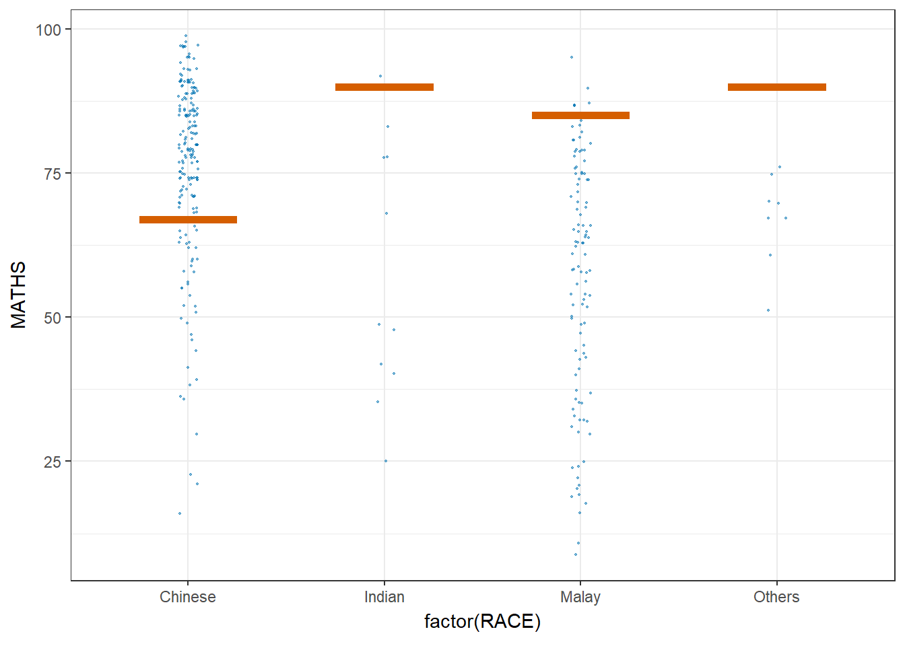

# 1 Learning Outcome

Visualising uncertainty poses a significant challenge in data visualisation. When we observe a data point placed at a particular location, we often perceive it as an exact reflection of the true data value. It's hard to grasp that the data point might actually exist within a range beyond where it's plotted. This situation is common in data visualisation, as nearly every dataset contains some degree of uncertainty. The decisions we make about whether and how to depict this uncertainty can greatly impact how accurately our audience understands the data's significance.

In this chapter, we will gain hands-on experience on creating statistical graphics for visualising uncertainty, including

-   plotting statistics error bars by using ggplot2,
-   plotting interactive error bars by combining ggplot2, plotly and DT,
-   creating advanced by using ggdist, and
-   creating hypothetical outcome plots (HOPs) by using ungeviz package.

# 2 Getting Started

::: panel-tabset
## Installing and loading libraries

For the purpose of this exercise, the following R packages will be used, they are:

-   tidyverse, a family of R packages for data science process,
-   plotly for creating interactive plot,
-   gganimate for creating animation plot,
-   DT for displaying interactive html table,
-   crosstalk for for implementing cross-widget interactions (currently, linked brushing and filtering), and
-   ggdist for visualising distribution and uncertainty.

```{r}
pacman::p_load(plotly, crosstalk, DT, 
               ggdist, ggridges, colorspace,
               gganimate, tidyverse, gifski)
```
:::

## Loading the data

Lets load the student exam data.csv for our exercise today.

```{r}
exam <- read_csv('data/Exam_data.csv')
```

# 3 Visualizing the uncertainty of point estimates (**ggplot2 methods**)

A point estimate is a single number, such as a mean. Uncertainty is expressed as standard error, confidence interval, or credible interval

::: callout-important
Don't confuse the uncertainty of a point estimate (mean, median..) with the variation in the sample (standard deviation sigma, and variation sigma square etc).
:::

### 3.1 ggplot2 methods

In this section, we learn how to plot error bars of maths scores by race by using data provided in exam tibble data frame.

The code chunk below performs the following:

-   `group_by()` of **dplyr** package groups the observation by RACE,

-   `summarise()` computes the count of observations, mean, standard deviation and standard error of Maths by RACE,

-   `mutate()` is used to derive standard error of Maths by RACE, and

-   save the output as a tibble data table called `my_sum`.

```{r}
my_sum <- exam %>% 
      group_by(RACE) %>% 
      summarise(n=n(),
                mean=mean(MATHS),
                sd = sd(MATHS)) %>% 
      mutate(se=sd/sqrt(n-1))   #<<< standard error formula
```

Next, the code chunk below will be used to display *my_sum* tibble data frame in an html table format.

```{r}
knitr::kable(head(my_sum), format = 'html')
```

### 3.1.1 Plotting standard error bars of point estimates

The code chunk below is used to reveal the **standard error** of **mean** maths score by race. It shows **one** standard deviation away from the 'mother of all means' for all the means from all the samples.

```{r}
#| code-fold: true
#| code-summary: "Show the code"
 
ggplot(my_sum) +
  geom_errorbar(
    aes(x=RACE, 
        ymin=mean-se, 
        ymax=mean+se), 
    width=0.2, 
    colour="black", 
    alpha=0.9, 
    linewidth=0.5) +
  geom_point(aes
           (x=RACE, 
            y=mean), 
           stat="identity", 
           color="red",
           size = 1.5,
           alpha=1) +
  ggtitle("Standard error of mean maths score by race")
```

::: callout-note
In the code above:

-   stat = 'identity' means that the y values in the geom_point layer correspond to the actual values in the data frame, rather than a summary statistic like mean or median.\
-   The error bars are computed by using the formula mean+/-se.
:::

### 3.1.2 Plotting confidence interval of point estimates

Instead of plotting the standard error bar of point estimates, we can also plot the confidence intervals of mean maths score by race.

Lets plot a 95% confidence interval of mean maths score by race. The error bars should be sorted by the average maths scores. (Refer to take-home ex 1 on sorting by mean)

```{r}
#| code-fold: true
#| code-summary: "Show the code"

ggplot(my_sum) +
  geom_errorbar(
    aes(x=reorder(RACE, -mean), 
        ymin=mean-1.96*se, 
        ymax=mean+1.96*se), 
    width=0.2, 
    colour="black", 
    alpha=0.9, 
    linewidth=0.5) +
  geom_point(aes
           (x=RACE, 
            y=mean), 
           stat="identity", 
           color="red",
           size = 1.5,
           alpha=1) +
  labs(x = "Maths score",
       title = "95% confidence interval of mean maths score by race")
```

::: callout-note
In the code above:

-   The confidence intervals are computed by using the formula mean+/-1.96\*se.
-   The error bars is sorted by using the average maths scores.
:::

### 3.1.3 Visualizing the uncertainty of point estimates with interactive error bars

In this section, you will learn how to plot interactive error bars for the 99% confidence interval of mean maths score by race.

We can also plot interactive error bars for the 99% confidence interval of mean maths score by race as shown in the figure below.

### plotly

```{r}
#| code-fold: true
#| code-summary: "Show the code"

shared_df = SharedData$new(my_sum)

bscols(widths = c(4,8),
       ggplotly((ggplot(shared_df) +
                   geom_errorbar(aes(
                     x=reorder(RACE, -mean),
                     ymin=mean-2.58*se, 
                     ymax=mean+2.58*se), 
                     width=0.2, 
                     colour="black", 
                     alpha=0.9, 
                     size=0.5) +
                   geom_point(aes(
                     x=RACE, 
                     y=mean, 
                     text = paste("Race:", `RACE`, 
                                  "<br>N:", `n`,
                                  "<br>Avg. Scores:", round(mean, digits = 2),
                                  "<br>95% CI:[", 
                                  round((mean-2.58*se), digits = 2), ",",
                                  round((mean+2.58*se), digits = 2),"]")),
                     stat="identity", 
                     color="red", 
                     size = 1.5, 
                     alpha=1) + 
                   xlab("Race") + 
                   ylab("Average Scores") + 
                   theme_minimal() + 
                   theme(axis.text.x = element_text(
                     angle = 45, vjust = 0.5, hjust=1)) +
                   ggtitle("99% Confidence interval of average /<br>maths scores by race")), 
                tooltip = "text"), 
       DT::datatable(shared_df, 
                     rownames = FALSE, 
                     class="compact", 
                     width="100%", 
                     options = list(pageLength = 10,
                                    scrollX=T), 
                     colnames = c("No. of pupils", 
                                  "Avg Scores",
                                  "Std Dev",
                                  "Std Error")) %>%
         formatRound(columns=c('mean', 'sd', 'se'),
                     digits=2))
```

# 4 Visualising Uncertainty: **ggdist** package

-   [**ggdist**](https://mjskay.github.io/ggdist/) is an R package that provides a flexible set of ggplot2 geoms and stats designed especially for **visualising** distributions and uncertainty.

-   It is designed for both frequentist and Bayesian uncertainty visualization, taking the view that uncertainty visualization can be unified through the perspective of distribution visualization:

    -   for frequentist models, one visualises confidence distributions or bootstrap distributions (see vignette("freq-uncertainty-vis"));

    -   for Bayesian models, one visualises probability distributions (see the tidybayes package, which builds on top of ggdist).

## 4.1 Visualizing the uncertainty of point estimates

In the code chunk below, [`stat_pointinterval()`](https://mjskay.github.io/ggdist/reference/stat_pointinterval.html) of **ggdist** is used to build a visual for displaying distribution of maths scores by race.

`stat_pointinterval` means points and multiple intervals. The default confidence interval us 95%. To change the level to 99%, add **conf.level = 0.99** to `stat_pointinterval` function.

Take note that the default .width values are set to c(0.66, 0.95) confidence intervals.

```{r}
#| code-fold: true
#| code-summary: "Show the code"

exam %>%
  ggplot(aes(x = RACE, 
             y = MATHS)) +
  stat_pointinterval() +
  labs(
    title = "Visualising confidence intervals of mean math score",
    subtitle = "Mean Point + Multiple-interval plot")
```

Some of the arguments:

-   `.width`: For intervals, the interval width as a numeric value in `[0, 1]`. For slabs, the width of the smallest interval containing that value of the slab.

-   `point_interval`: This function determines the point summary (typically mean, median, or mode) and interval type (quantile interval, `qi`; highest-density interval, `hdi`; or highest-density continuous interval, `hdci`)

-   For example, in the code chunk below the following arguments are used:

    -   .width = 0.95

    -   .point = median

    -   .interval = qi

```{r}
#| code-fold: true
#| code-summary: "Show the code"
exam %>%
      ggplot(aes(x = RACE, y = MATHS)) +
      stat_pointinterval(
        .width = 0.95,       #<< 
        .point = median,     #<< 
        .interval = qi) +    #<< 
  labs(
    title='Visualising confidence intervals of mean math score',
    subtitle = "Mean Point + Multiple-interval plot, 95% only",
       x= "Race",
       y= "Math")
```

```{r}
#| code-fold: True
exam %>%
  ggplot(aes(x = RACE, y = MATHS)) +
  
  #Using stat_pointinterval to plot the points and intervals
  stat_pointinterval(
    .width = c(0.95,0.99), #<<
  .point = median,
  .interval = qi,
  aes(interval_color=stat(level)),
  show.legend = FALSE) +
  
  #Defining the color of the intervals 
  scale_color_manual(
    values = c("#73b2c4", "#f27279"),
    aesthetics = "interval_color") +
  
  #Title, subtitle, and caption
    labs(
    title='Visualising confidence intervals of mean math score',
    subtitle = "Mean Point + Multiple-interval plot, 95% and 99%",
       x= "Race",
       y= "Math")
```

## 4.2 **Visualizing the uncertainty of point estimates: ggdist methods**

Makeover the plot on previous slide by showing 95% and 99% confidence intervals.

```{r}
#| code-fold: True

exam %>%
  ggplot(aes(x = RACE, 
             y = MATHS)) +
  stat_pointinterval(
    show.legend = FALSE) +   
  labs(
    title = "Visualising confidence intervals of mean math score",
    subtitle = "Mean Point + Multiple-interval plot")
```

## 4.3 **Visualizing the uncertainty of point estimates: ggdist methods**

In the code chunk below, [`stat_gradientinterval()`](https://mjskay.github.io/ggdist/reference/stat_gradientinterval.html) of **ggdist** is used to build a visual for displaying distribution of maths scores by race.

```{r}
exam %>%
  ggplot(aes(x = RACE, 
             y = MATHS)) +
  stat_gradientinterval(   
    fill = "skyblue",      
    show.legend = TRUE     
  ) +                        
  labs(
    title = "Visualising confidence intervals of mean math score",
    subtitle = "Gradient + interval plot")
```

# 5 Visualising Uncertainty with Hypothetical Outcome Plots (HOPs)

### **5.1 Installing ungeviz package**

```{r}
# devtools::install_github("wilkelab/ungeviz")
```

### 5.2 Launch the application in R

```{r}
library(ungeviz)
```

### **5.3 Visualising Uncertainty with Hypothetical Outcome Plots (HOPs)**

Next, the code chunk below will be used to build the HOPs.

```{r}
#| warning: false
#| message: false

p <- ggplot(data = exam,
       aes(x = factor(RACE),
           y = MATHS)) +
  geom_point(position = position_jitter(
    height = 0.3,
    width = 0.05),
    size = 0.4,
    color = "#0072B2",
    alpha = 1/2) +
  geom_hpline(data = sampler(25, group = RACE),
              height = 0.6,
              color = "#D55E00") +
  theme_bw() +
  transition_states(.draw, 1, 3)

my_anim <- animate(p, renderer = gifski_renderer())

# Save directly to the current folder to avoid path errors
anim_save("hops_animation.gif", animation = my_anim)

# Force Quarto to embed the saved image into the rendered HTML

```
